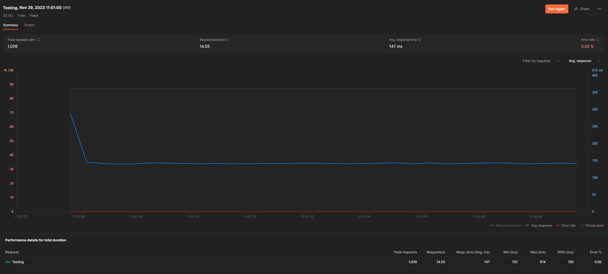
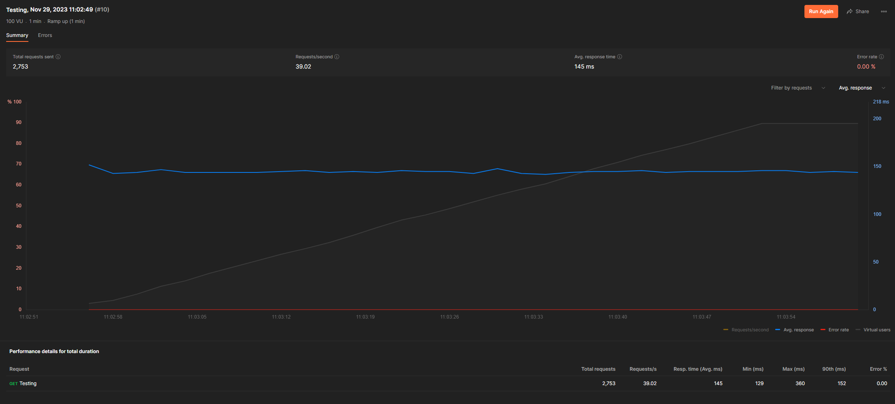

# Wildfire

## Wildfire joke web service
This structure of web app is something that my mentor taught me back in 2018 when I first started using go. It focuses on defining a service for each layer (http, app, database, etc) and using those layers to build on top of each other. I've used two personal repos of mine https://github.com/hunterdishner/gomux and https://github.com/hunterdishner/errors . GoMux, wraps gorilla mux into an easier to use version that has automatic struct marshaling into json and error handling. Mainly, it detects if there is an struct of type errors (my other package) and if it is it will return the error code defined in that error and marshal it into jason. If the struct type was anything other than error then it assumes a 200 OK and marshals the struct into json (in this case just a string accoridng to directions example). 

Both of these packages are something I first wrote in 2019 but then made public in 2020. GoMux itself could use some more security scrutiny as I'm sure its not 100% rock solid but it does at least handle Cors, TLS, and plays well with a reverse proxy too. 

Typically I'd stand this type of service up with an authentication service, a reverse proxy, and host it in cloud run with GCP. Pairing those 3 with cloudflare and a small CDN network for the front end has usually worked well for me, but admittedly I've had devops engineers that have helped me with that over the years. 

### Run Instructions

You will need the latest version of go 1.21 installed and the latest version of docker. I devleoped this on a windows machine so hopefully that doesn't cause any issues with Mac / Linux.

Open up the repo and initially you may need to run `go get github.com/hunterdishner/gomux` and `go get github.com/hunterdishner/errors` just to be sure its pulled both packages down to your machine.

Then build and run the docker container using

```docker build -t wildfire .```

```docker run -it -p 10000:10000 wildfire```

### Example Api Requests

```https://localhost:10000/api/joke```

Response
```
"Cebria Ferree is the only human being to display the Heisenberg uncertainty principle - you can never know both exactly where and how quickly he will roundhouse-kick you in the face."
```

```https://localhost:10000/api/joke?firstName=Hunter&lastName=Dishner```

Response
```
"Hunter Dishner doesn't have disk latency because the hard drive knows to hurry the hell up."
```

### Example Failure Request

```https://localhost:10000/api/joke?forceError=1```

Response
```json
{
    "code": 500,
    "op": "",
    "kind": 9,
    "err": "Forced Error for demonstration purposes",
    "stack": [
        "/app/http/joke.go:14 return nil, errors.E(errors.CodeServerError, errors.Decoding, \"Forced Error for demonstration purposes\")\r",
        "github.com/hunterdishner/gomux@v1.0.1/gomux.go:231 data, err := fn(w, r)",
        "net/http/server.go:2136 f(w, r)"
    ]
}
```


## Load Tests

### This one is with 20 users and the external services enabled. I chose 20 users and a 1 minute time frame just to be courteous to the owners of those APIs and not run up a bunch of costs. 


### Then this one is with 100 concurrent users (the max postman lets me use) and it disabled the calls to the external services and just tests my packages and code for the http and app layers. 
Note: I had to turn off TLS because of the Todo for generating a new certificate. Postman does not like self signed certificates and was flagging all the responses as failures because of it.
